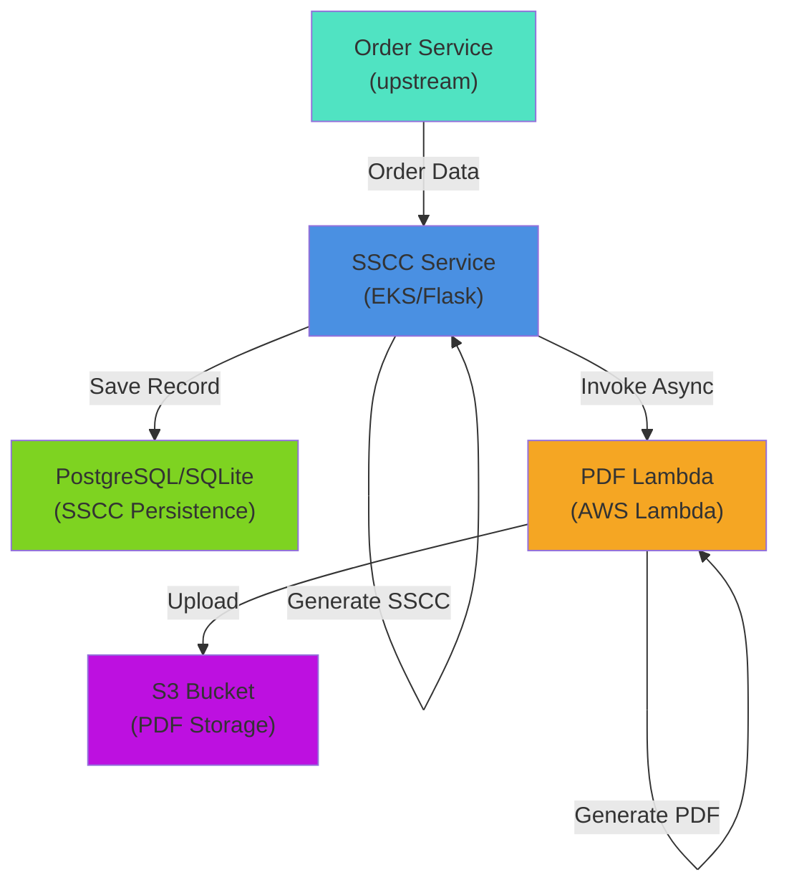
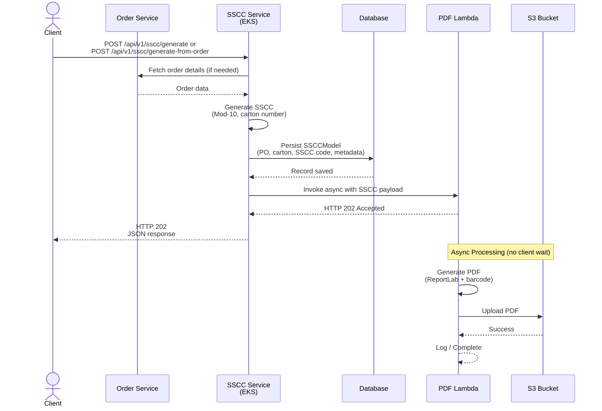

# SSCC Service

A Flask microservice that generates **GS1 Serial Shipping Container Codes (SSCC)** and orchestrates PDF shipping label generation, consuming order data from an upstream order service and delegating PDF generation to a separate AWS Lambda microservice.

---

## Architecture Overview



---

## Workflow

### Complete End-to-End Flow



### Step-by-Step Details

**1. Request Reception**
- Client sends SSCC generation request to `/api/v1/sscc/generate` or `/api/v1/sscc/generate-from-order`
- Marshmallow schema validates all required fields

**2. Order Lookup (if using `/generate-from-order`)**
- EKS service fetches order details from upstream order service
- Returns PO number, customer name, supplier name, etc.

**3. SSCC Generation**
- Service calls `generate_sscc()` to produce:
  - 18-digit GS1-compliant SSCC (Mod-10 check digit)
  - Carton number (auto-generated or custom)

**4. Database Persistence**
- `SSCCModel` instance created with all SSCC metadata
- Record committed to database (PostgreSQL in prod, SQLite in tests)
- Ensures traceability and audit trail

**5. Lambda Invocation**
- `boto3.client("lambda").invoke()` called asynchronously
- Function name: `sscc-pdf-generator`
- Invocation type: `Event` (async, fire-and-forget)
- Payload includes all SSCC metadata

**6. Immediate Response**
- EKS returns HTTP 202 (Accepted) with SSCC data
- Client does not wait for PDF generation
- PDF is available in S3 once Lambda completes

---

## Features

| Feature | Detail |
|---|---|
| SSCC generation | 18-digit GS1-compliant SSCC via Mod-10 check digit |
| Carton numbering | Auto-generated from supplier/customer initials + 7-digit sequence |
| Database persistence | Stores all SSCC metadata for traceability and audit |
| Order integration | Fetches order data from `order-service:5007` |
| Lambda orchestration | Asynchronous PDF generation via AWS Lambda |
| Validation | Marshmallow schemas on all incoming payloads |

---

## Project Structure

```
sscc-service/
├── src/
│   ├── sscc/
│   │   ├── __init__.py                # App factory (create_app, db.init_app)
│   │   ├── config.py                  # Configuration classes
│   │   ├── extensions.py              # Flask extensions (Marshmallow)
│   │   ├── extentions/
│   │   │   ├── db.py                  # SQLAlchemy instance
│   │   │   └── redis.py               # Redis (optional)
│   │   ├── models/
│   │   │   └── sscc_model.py          # SSCCModel (ORM), SSCCRequest, SSCCResult
│   │   ├── schemas/
│   │   │   └── sscc_schema.py         # Marshmallow validation schemas
│   │   ├── resources/
│   │   │   ├── __init__.py            # Blueprint registration
│   │   │   ├── sscc_resource.py       # /api/v1/sscc/* routes
│   │   │   └── health_resource.py
│   │   ├── services/
│   │   │   ├── sscc_service.py        # SSCC generation logic
│   │   │   ├── pdf_service.py         # PDF label generation (local, legacy)
│   │   │   └── order_client.py        # HTTP client for order-service
│   │   └── pdf/
│   │       ├── handlers/
│   │       │   └── lambda_handler.py  # AWS Lambda entry points
│   │       └── services/
│   │           ├── pdf_service.py     # PDF generation (Lambda)
│   │           └── s3_service.py      # S3 upload (Lambda)
├── tests/
│   ├── conftest.py                    # Pytest fixtures
│   ├── test_sscc_service.py           # SSCC logic tests
│   └── test_sscc_resource.py          # API endpoint tests
│   └── test_sscc_resource_separation.py # Lambda separation & persistence tests
├── run.py
├── pyproject.toml
├── Dockerfile
├── .env
├── .flaskenv
└── README_PDF_MICROSERVICE.md         # PDF Lambda standalone deployment
```

---

## API Endpoints

### `POST /api/v1/sscc/generate`
Generate SSCC and trigger Lambda-based PDF label generation.

**Request body (JSON):**
```json
{
  "po_number": "PO-2024-001",
  "customer_name": "Acme Retail",
  "supplier_name": "Beta Logistics",
  "store": "Store 42",
  "location": "Warehouse A",
  "check_digit": 0,
  "quantities": 100,
  "product": "Widget XL",
  "carton_number": "BLAR0000001"
}
```
> `carton_number` is optional. If omitted, it is auto-generated as  
> `<2 supplier initials><2 customer initials><7-digit sequence>` e.g. `BLAR0000001`.

**Response:** HTTP 202 Accepted
```json
{
  "message": "PDF generation started",
  "sscc_code": "012345670000000014",
  "carton_number": "BLAR0000001"
}
```
> SSCC record is persisted to database. PDF generation happens asynchronously in Lambda.

---

### `POST /api/v1/sscc/generate/json`
Generate SSCC and return metadata as JSON only (no PDF or Lambda invocation).

**Response:** HTTP 201 Created
```json
{
  "sscc_code": "012345670000000014",
  "carton_number": "BLAR0000001",
  "po_number": "PO-2024-001",
  "customer_name": "Acme Retail",
  "supplier_name": "Beta Logistics",
  "store": "Store 42",
  "location": "Warehouse A",
  "quantities": 100,
  "product": "Widget XL"
}
```

---

### `POST /api/v1/sscc/generate-from-order`
Fetch order details and generate SSCC with Lambda-based PDF.

**Request body (JSON):**
```json
{
  "po_number": "PO-2024-999",
  "check_digit": 5,
  "carton_number": "CUST0000042"  # optional
}
```

**Response:** HTTP 202 Accepted (same as `/generate`)

---

### `GET /health`
Health check endpoint.

**Response:** HTTP 200
```json
{
  "status": "ok"
}
```

---

## Database Schema

The `sscc_labels` table persists all SSCC generation records:

| Column | Type | Notes |
|---|---|---|
| `sscc_id` | Integer | Primary key |
| `sscc_code` | String(18) | Unique, GS1-compliant SSCC |
| `carton_number` | String(32) | Business key (with po_number) |
| `po_number` | String(128) | Purchase order reference |
| `customer_name` | String(128) | Customer name |
| `supplier_name` | String(128) | Supplier name |
| `store` | String(128) | Store/location code |
| `location` | String(128) | Warehouse/DC location |
| `check_digit` | Integer | GS1 extension digit (0-9) |
| `quantities` | Integer | Carton quantity |
| `product` | String(256) | Product description |
| `created_at` | DateTime | Auto-set to now (UTC) |
| `updated_at` | DateTime | Auto-set to now (UTC), updated on changes |

**Unique Constraints:**
- `sscc_code` (one SSCC per carton)
- `(po_number, carton_number)` (one carton per PO)

---

## Setup & Deployment

### Local Development

1. **Clone and install:**
   ```bash
   git clone <repo>
   cd sscc-service
   pip install -e .
   ```

2. **Configure environment:**
   ```bash
   cp .env.example .env
   # Edit .env with your settings
   ```

3. **Run tests:**
   ```bash
   python -m pytest -q
   ```

4. **Start server:**
   ```bash
   python run.py
   ```

### Production (EKS)

1. **Build Docker image:**
   ```bash
   docker build -t sscc-service:latest .
   ```

2. **Deploy to Kubernetes:**
   ```bash
   kubectl apply -f deployment.yaml
   ```

3. **Ensure Lambda function exists:**
   - Function name: `sscc-pdf-generator`
   - See [README_PDF_MICROSERVICE.md](README_PDF_MICROSERVICE.md) for Lambda setup

---

## Configuration

**Environment variables** (see `config.py`):

| Variable | Default | Purpose |
|---|---|---|
| `SECRET_KEY` | `dev-secret-change-in-production` | Flask session secret |
| `GS1_COMPANY_PREFIX` | `1234567` | Your assigned GS1 company prefix (7 digits) |
| `SSCC_EXTENSION_DIGIT` | `0` | GS1 extension digit for SSCC |
| `ORDER_SERVICE_URL` | `http://order-service:5007` | Order service base URL |
| `SQLALCHEMY_DATABASE_URI` | `sqlite:///:memory:` | Database connection string |

---

## Troubleshooting

### Lambda invocation fails
- Ensure AWS credentials are configured (`AWS_ACCESS_KEY_ID`, `AWS_SECRET_ACCESS_KEY`)
- Verify Lambda function `sscc-pdf-generator` exists in your AWS account
- Check IAM permissions for the EKS pod role

### SSCC code generation mismatch
- Verify `GS1_COMPANY_PREFIX` matches your assigned GS1 prefix
- Ensure `SSCC_EXTENSION_DIGIT` is in range 0-9
- Check Mod-10 check digit calculation in `sscc_service.py`

### Database connection errors
- For production, set `SQLALCHEMY_DATABASE_URI` to your PostgreSQL connection string
- Ensure database user has permissions to create/alter tables
- Run migrations if using Alembic

---

## Links

- [PDF Microservice Deployment](README_PDF_MICROSERVICE.md)
- [GS1 SSCC Specification](https://www.gs1.org/)
- [ReportLab Documentation](https://www.reportlab.com/)

---


### `POST /api/v1/sscc/generate-from-order`
Fetch order details from the order service, then return a PDF label.

**Request body:**
```json
{
  "po_number": "PO-2024-001",
  "check_digit": 0,
  "carton_number": null
}
```

---

### `GET /health`
```json
{ "status": "ok", "service": "sscc-service" }
```

---

## SSCC Structure

```
[ Extension (1) ][ GS1 Company Prefix (7) ][ Serial Reference (9) ][ Check Digit (1) ]
       ↑                    ↑                        ↑                      ↑
  check_digit input    GS1_COMPANY_PREFIX      from carton seq.       GS1 Mod-10
```

---

## Configuration

| Variable | Default | Description |
|---|---|---|
| `SECRET_KEY` | `dev-secret-...` | Flask secret key |
| `GS1_COMPANY_PREFIX` | `1234567` | Your GS1-assigned 7-digit company prefix |
| `SSCC_EXTENSION_DIGIT` | `0` | Default extension digit |
| `ORDER_SERVICE_URL` | `http://order-service:5007` | Upstream order service URL |

---

## Running Locally

```bash
python -m venv .venv
source .venv/bin/activate          # Windows: .venv\Scripts\activate
pip install ".[dev]"
flask run
```

## Running with Docker

```bash
docker build -t sscc-service .
docker run -p 5000:5000 \
  -e GS1_COMPANY_PREFIX=1234567 \
  -e ORDER_SERVICE_URL=http://order-service:5007 \
  sscc-service
```

## Tests

```bash
pytest --cov=sscc --cov-report=term-missing
```
